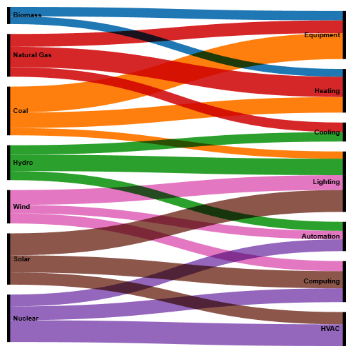

# TDS-week-8-q6
24f2004824@ds.study.iitm.ac.in
# Sankey Diagram – Resource Efficiency Visualization

Sankey diagram created using RAWGraphs showing the flow of resources and costs through a manufacturing process, highlighting efficient paths, waste streams, and recycling loops for process optimization.

**Submitted by:**  
24f2004824@ds.study.iitm.ac.in

**Visualization:**  

